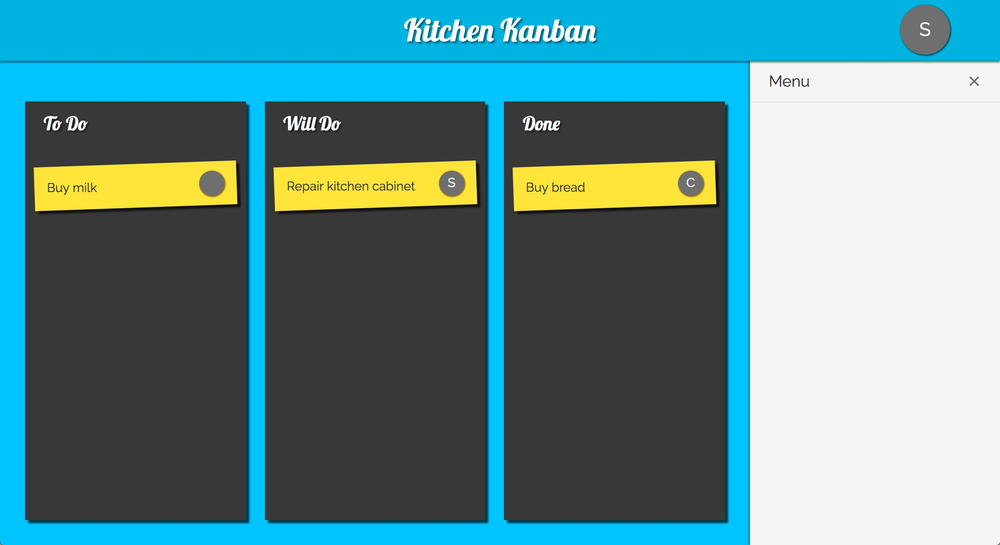

# Kitchen Kanban

This is still a work in progress. Kitchen Kanban is a practice react project.

I'm building a small trello-like kanban board.

In the end, I want the following features:

* Progressive web app to update on the go
* Sync with firebase for realtime updates
* Authenticate users with social media